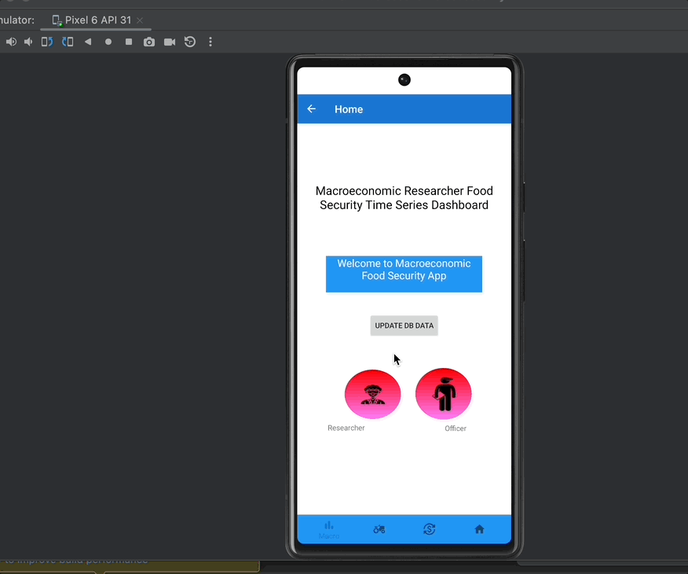
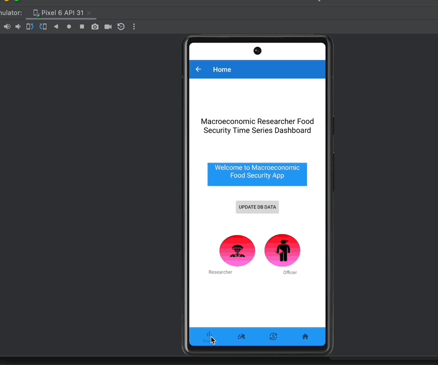
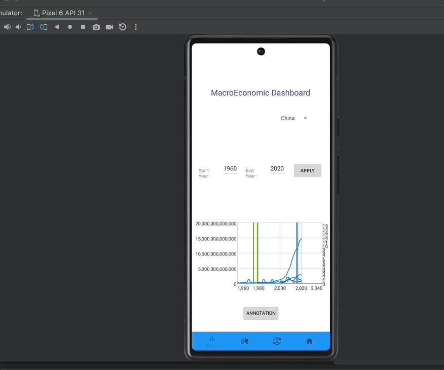
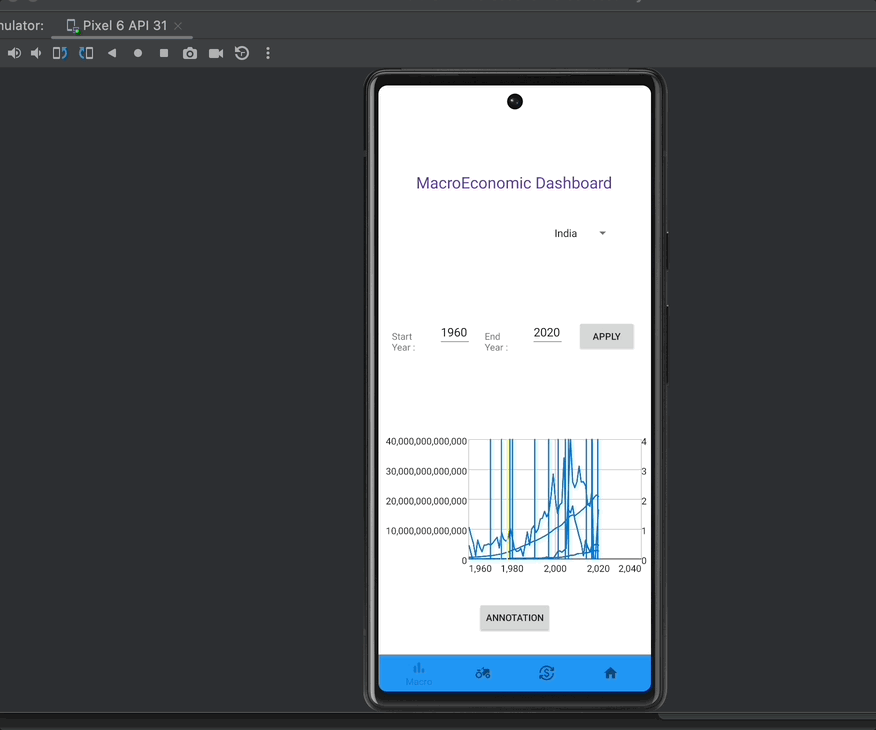
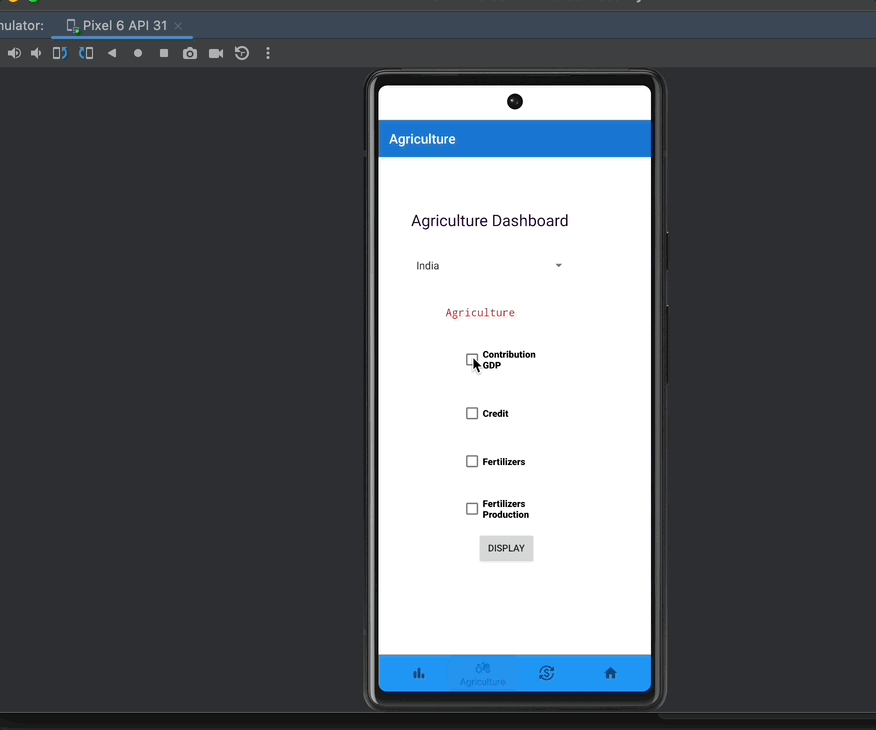
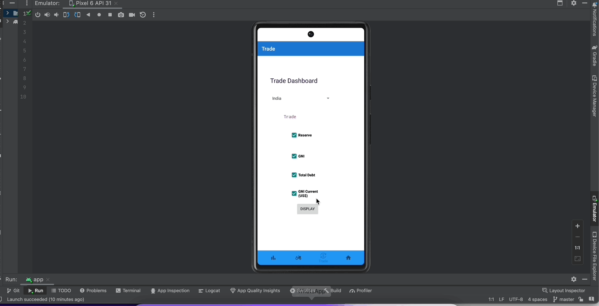

# CMPE 277 Hackathon- Macro Economic And Food Security App

# Introduction

### Team Name: Code Builders 
### Team Members:  
Bhavya Hegde - 016656029 
Darshini Venkatesha Murthy Nag - 016668951 
Sirisha Polisetty - 016012477 

# Application Requirement

* Country selector 
* Should be able to render time series
* Support Network and Local Mode
* Menu Select
* Annotation Support 

App Launched Successfully. Below screenshot shows the Home Page of the App.

On the Click of Macro icon from the footer in the home page, Macro economic Dashboard will be displayed as shown below.Select the country and checkboxes to render the particular time-series graph as shown below

On the Click of Agriculture icon from the footer in the home page, Agriculture Dashboard will be displayed.Select the country and checkboxes to render the particular time-series graph as shown below.

On the Click of Trade icon from the footer in the home page, Trade Dashboard will be displayed as shown below.Select the country and checkboxes to render the particular time-series graph as shown below

